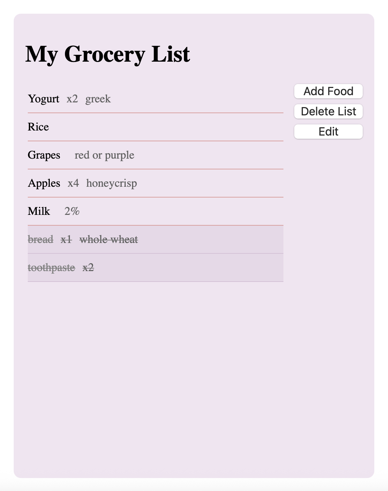
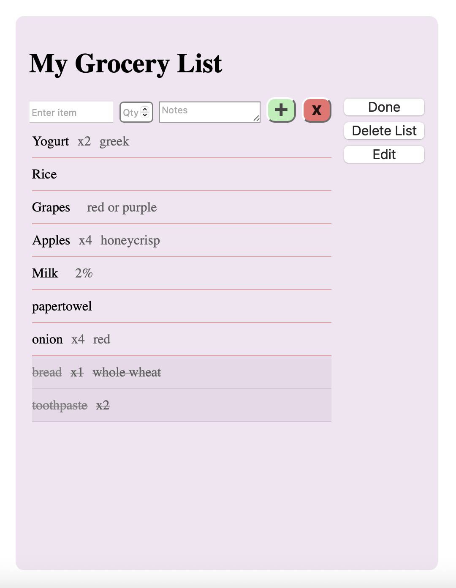
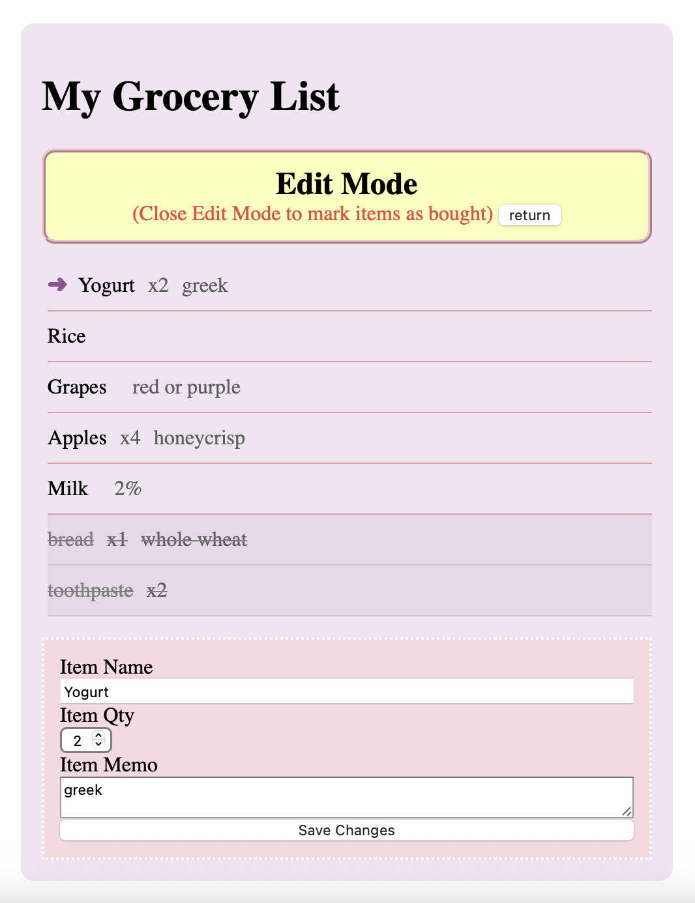

# Grocery List

A browser-based grocery list application built with HTML, CSS, and JavaScript.

This was my first complete personal web development project. I created it to practise DOM manipulation, event handling, data storage, CSS layout and sizing, and organizing JavaScript into separate functions.

## Features

- Add grocery items
- Add an optional quantity and memo
- Prevent duplicate item names
- Mark items as bought or unbought
- Automatically move bought items to the bottom of the list
- Edit existing items
- Swipe items to the left to delete them
- Delete the entire list
- Save the list using `localStorage`
- Restore saved items when the page reloads
- Press Enter or click the plus button to add an item

## Technologies Used

- HTML
- CSS
- JavaScript
- Browser `localStorage`

## How to Use

1. Click **Add Food** to open the input section.
2. Enter the item name.
3. Optionally enter a quantity and memo.
4. Click the green plus button or press Enter to add the item.
5. Click an item to mark it as bought.
6. Click **Edit** to enter Edit Mode.
7. Select an item, change its information, and click **Save Changes**.
8. Swipe an item to the left to delete it.
9. Click **Delete List** to remove every item.

## How It Works

Each grocery item is created with JavaScript and added to the page as a list element.

The item’s name, quantity, and memo are stored using HTML `data-*` attributes. The displayed text is updated from that stored data.

When the list changes, the items are converted into JavaScript objects and saved in `localStorage`. When the page reloads, the saved data is read and the grocery items are created again.

## What I Learned

While creating this project, I practised:

- Selecting HTML elements with `getElementById()` and `querySelector()`
- Creating elements with `document.createElement()`
- Adding elements with `appendChild()` and `insertBefore()`
- Using event listeners
- Working with the event object
- Handling pointer events for swipe gestures
- Using `classList` to change an element’s state
- Storing information with `dataset`
- Saving and loading JSON data with `localStorage`
- Using functions to separate different responsibilities
- Using `const` and `let`
- Checking and validating user input
- Preventing duplicate grocery items

## Project Structure

```text
groceryList/
├── images/
│   ├── groceryList.png
│   ├── groceryAdd.png
│   └── groceryEdit.png
├── index.html
├── script.js
├── styles.css
├── README.md
└── LICENSE
```

## Running the Project

1. Download or clone the repository.
2. Open the project folder.
3. Open `index.html` in a web browser.

You can also run it using a local development extension such as Live Server or Live Preview in Visual Studio Code.

## Current Limitations

- The current version is designed mainly for desktop and laptop browsers.
- The list is stored only in the current browser.
- Saved lists are not shared between devices or users.
- There are no user accounts or online database integration.

## Future Improvements

Possible future improvements include:

- Improve the mobile layout
- Add an undo-delete feature
- Add categories for grocery items
- Add drag-and-drop item ordering
- Add an empty-list message
- Store lists using an online database

## Screenshots

### Main Screen



### Adding an Item



### Edit Mode



## Author

Created by **sofiahplr**.
